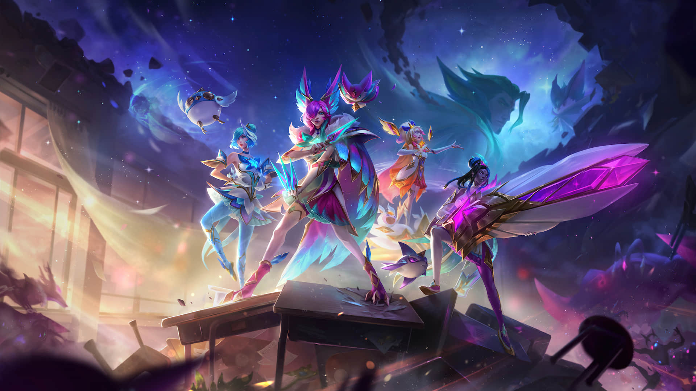
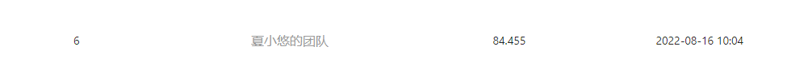

<p align="center"><h1 align="center">飞桨学习赛：英雄联盟大师预测</h1></p>

<p align="center">
 <br />
</p>

## 题目背景
实时对战游戏是人工智能研究领域的一个热点话题。由于实时对战游戏存在复杂性、部分可观察性和动态实时变化性等特点，使得对其的研究变得比较困难。我们可以在选择英雄阶段预测胜负概率，也可以在比赛期间根据比赛实时数据进行建模。那么，玩家有可能在英雄联盟对局进行期间，得知自己的胜率吗？

## 比赛任务
本赛题数据为英雄联盟玩家的实时游戏数据，记录了用户在游戏中的对局数据，如击杀数、住物理伤害等，希望参赛选手能从数据集中挖掘出数据的规律，并预测玩家在本局游戏中的输赢情况。

## 数据集介绍
赛题数据集共100MB，细分如下：

训练集：共800万数据

测试集：共2万数据

## 数据说明
数据集中每一行为一个玩家的游戏数据，数据字段如下所示：

- id：玩家记录id
- win：是否胜利，标签变量
- kills：击杀次数
- deaths：死亡次数
- assists：助攻次数
- largestkillingspree：最大 killing spree（游戏术语，意味大杀特杀。当你连续杀死三个对方英雄而中途没有死亡时）
- largestmultikill：最大mult ikill（游戏术语，短时间内多重击杀）
- longesttimespentliving：最长存活时间
- doublekills：doublekills次数
- triplekills：doublekills次数
- quadrakills：quadrakills次数
- pentakills：pentakills次数
- totdmgdealt：总伤害
- magicdmgdealt：魔法伤害
- physicaldmgdealt：物理伤害
- truedmgdealt：真实伤害
- largestcrit：最大暴击伤害
- totdmgtochamp：对对方玩家的伤害
- magicdmgtochamp：对对方玩家的魔法伤害
- physdmgtochamp：对对方玩家的物理伤害
- truedmgtochamp：对对方玩家的真实伤害
- totheal：治疗量
- totunitshealed：痊愈的总单位
- dmgtoturrets：对炮塔的伤害
- timecc：法控时间
- totdmgtaken：承受的伤害
- magicdmgtaken：承受的魔法伤害
- physdmgtaken：承受的物理伤害
- truedmgtaken：承受的真实伤害
- wardsplaced：侦查守卫放置次数
- wardskilled：侦查守卫摧毁次数
- firstblood：是否为firstblood
 
测试集中label字段win为空，需要选手预测。

## 评测指标
本次竞赛的使用准确率进行评分，数值越高精度越高，评估代码参考：

```python
from sklearn.metrics import accuracy_score

y_pred = [0, 2, 1, 3]
y_true = [0, 1, 2, 3]
accuracy_score(y_true, y_pred)
```

    关于比赛的更多信息，可参考官方发布的[说明](https://aistudio.baidu.com/aistudio/competition/detail/247/0/introduction)。

## 比赛结果
    训练信息：
        train score:  0.854238888888889
    提交结果：
        submission: 0.84455(划分训练集)

<p align="center">
 <br />
</p>

## 代码说明
最终提交方案参考代码文件`lol.py`

各方案分析过程参考代码文件`lol.ipynb`