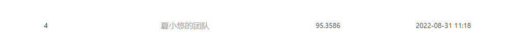

<p align="center"><h1 align="center">飞桨学习赛：吃鸡排名预测挑战赛</h1></p>

<p align="center">
 <br />
</p>

## 题目背景
《绝地求生》(PUBG) 是一款战术竞技型射击类沙盒游戏。在游戏中，玩家需要在游戏地图上收集各种资源，并在不断缩小的安全区域内对抗其他玩家，让自己生存到最后。当选手在本局游戏中取得第一名后，会有一段台词出现：“大吉大利，晚上吃鸡!”。

官方提供了PUBG游戏数据中玩家的行为数据，希望参赛选手能够构建模型对玩家每局最终排名进行预测。

## 题目任务
本次任务希望大家构建吃鸡排名预测模型。通过每位玩家的统计信息、队友统计信息、本局其他玩家的统计信息等，预测最终的游戏排名。注意排名是按照队伍排名，若多位玩家在PUBG一局游戏中组队，则最终排名相同。

## 数据简介
数据集下载链接：[https://aistudio.baidu.com/aistudio/datasetdetail/137263](https://aistudio.baidu.com/aistudio/datasetdetail/137263)

赛题训练集案例如下：

- 训练集5万数据，共150w行
- 测试集共5000条数据，共50w行

赛题数据文件总大小150MB，数据均为csv格式，列使用逗号分割。

测试集中label字段team_placement为空，需要选手预测。完整的数据字段含义如下：

- match_id：本局游戏的id
- team_id：本局游戏中队伍id，表示在每局游戏中队伍信息
- game_size：本局队伍数量
- party_size：本局游戏中队伍人数
- player_assists：玩家助攻数
- player_dbno：玩家击倒数
- player_dist_ride：玩家车辆行驶距离
- player_dist_walk：玩家不幸距离
- player_dmg：输出伤害值
- player_kills：玩家击杀数
- player_name：玩家名称，在训练集和测试集中全局唯一
- kill_distance_x_min：击杀另一位选手时最小的x坐标间隔
- kill_distance_x_max：击杀另一位选手时最大的x坐标间隔
- kill_distance_y_min：击杀另一位选手时最小的y坐标间隔
- kill_distance_y_max：击杀另一位选手时最大的x坐标间隔
- team_placement：队伍排名

## 评测指标
本次竞赛的使用绝对回归误差MAE进行评分，数值越低精度越高，评估代码参考：

```python
from sklearn.metrics import mean_absolute_error

y_pred = [0, 2, 1, 3]
y_true = [0, 1, 2, 3]
100 - mean_absolute_error(y_true, y_pred)
```

    关于比赛的更多信息，可参考官方发布的[说明](https://aistudio.baidu.com/aistudio/competition/detail/155/0/introduction)。

## 比赛结果
    训练信息：
        MAE: 4.539792
    提交结果：
        submission: 95.3586

<p align="center">
 <br />
</p>

## 代码说明
最终提交方案参考代码文件`pubg.py`

各方案分析过程参考代码文件`pubg.ipynb`